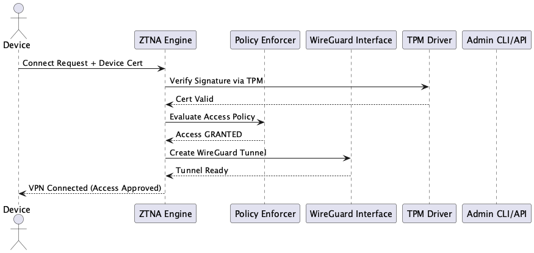

# Oblivion Edge: Free the Router. Free the Code.

▓█████  ███▄    █  ▄████▄   ██▀███ ▓██   ██▓ ██▓███  ▄▄▄█████▓   ▓█████ ██▒   █▓▓█████  ██▀███ ▓██   ██▓▄▄▄█████▓ ██░ ██  ██▓ ███▄    █   ▄████ 
▓█   ▀  ██ ▀█   █ ▒██▀ ▀█  ▓██ ▒ ██▒▒██  ██▒▓██░  ██▒▓  ██▒ ▓▒   ▓█   ▀▓██░   █▒▓█   ▀ ▓██ ▒ ██▒▒██  ██▒▓  ██▒ ▓▒▓██░ ██▒▓██▒ ██ ▀█   █  ██▒ ▀█▒
▒███   ▓██  ▀█ ██▒▒▓█    ▄ ▓██ ░▄█ ▒ ▒██ ██░▓██░ ██▓▒▒ ▓██░ ▒░   ▒███   ▓██  █▒░▒███   ▓██ ░▄█ ▒ ▒██ ██░▒ ▓██░ ▒░▒██▀▀██░▒██▒▓██  ▀█ ██▒▒██░▄▄▄░
▒▓█  ▄ ▓██▒  ▐▌██▒▒▓▓▄ ▄██▒▒██▀▀█▄   ░ ▐██▓░▒██▄█▓▒ ▒░ ▓██▓ ░    ▒▓█  ▄  ▒██ █░░▒▓█  ▄ ▒██▀▀█▄   ░ ▐██▓░░ ▓██▓ ░ ░▓█ ░██ ░██░▓██▒  ▐▌██▒░▓█  ██▓
░▒████▒▒██░   ▓██░▒ ▓███▀ ░░██▓ ▒██▒ ░ ██▒▓░▒██▒ ░  ░  ▒██▒ ░    ░▒████▒  ▒▀█░  ░▒████▒░██▓ ▒██▒ ░ ██▒▓░  ▒██▒ ░ ░▓█▒░██▓░██░▒██░   ▓██░░▒▓███▀▒
░░ ▒░ ░░ ▒░   ▒ ▒ ░ ░▒ ▒  ░░ ▒▓ ░▒▓░  ██▒▒▒ ▒▓▒░ ░  ░  ▒ ░░      ░░ ▒░ ░  ░ ▐░  ░░ ▒░ ░░ ▒▓ ░▒▓░  ██▒▒▒   ▒ ░░    ▒ ░░▒░▒░▓  ░ ▒░   ▒ ▒  ░▒   ▒ 
 ░ ░  ░░ ░░   ░ ▒░  ░  ▒     ░▒ ░ ▒░▓██ ░▒░ ░▒ ░         ░        ░ ░  ░  ░ ░░   ░ ░  ░  ░▒ ░ ▒░▓██ ░▒░     ░     ▒ ░▒░ ░ ▒ ░░ ░░   ░ ▒░  ░   ░ 
   ░      ░   ░ ░ ░          ░░   ░ ▒ ▒ ░░  ░░         ░            ░       ░░     ░     ░░   ░ ▒ ▒ ░░    ░       ░  ░░ ░ ▒ ░   ░   ░ ░ ░ ░   ░ 
   ░  ░         ░ ░ ░         ░     ░ ░                             ░  ░     ░     ░  ░   ░     ░ ░               ░  ░  ░ ░           ░       ░ 
                  ░                 ░ ░                                     ░                   ░ ░                                             
▄▄▄█████▓ ██▀███   █    ██   ██████ ▄▄▄█████▓    ███▄    █  ▒█████      ▒█████   ███▄    █ ▓█████                                               
▓  ██▒ ▓▒▓██ ▒ ██▒ ██  ▓██▒▒██    ▒ ▓  ██▒ ▓▒    ██ ▀█   █ ▒██▒  ██▒   ▒██▒  ██▒ ██ ▀█   █ ▓█   ▀                                               
▒ ▓██░ ▒░▓██ ░▄█ ▒▓██  ▒██░░ ▓██▄   ▒ ▓██░ ▒░   ▓██  ▀█ ██▒▒██░  ██▒   ▒██░  ██▒▓██  ▀█ ██▒▒███                                                 
░ ▓██▓ ░ ▒██▀▀█▄  ▓▓█  ░██░  ▒   ██▒░ ▓██▓ ░    ▓██▒  ▐▌██▒▒██   ██░   ▒██   ██░▓██▒  ▐▌██▒▒▓█  ▄                                               
  ▒██▒ ░ ░██▓ ▒██▒▒▒█████▓ ▒██████▒▒  ▒██▒ ░    ▒██░   ▓██░░ ████▓▒░   ░ ████▓▒░▒██░   ▓██░░▒████▒                                              
  ▒ ░░   ░ ▒▓ ░▒▓░░▒▓▒ ▒ ▒ ▒ ▒▓▒ ▒ ░  ▒ ░░      ░ ▒░   ▒ ▒ ░ ▒░▒░▒░    ░ ▒░▒░▒░ ░ ▒░   ▒ ▒ ░░ ▒░ ░                                              
    ░      ░▒ ░ ▒░░░▒░ ░ ░ ░ ░▒  ░ ░    ░       ░ ░░   ░ ▒░  ░ ▒ ▒░      ░ ▒ ▒░ ░ ░░   ░ ▒░ ░ ░  ░                                              
  ░        ░░   ░  ░░░ ░ ░ ░  ░  ░    ░            ░   ░ ░ ░ ░ ░ ▒     ░ ░ ░ ▒     ░   ░ ░    ░                                                 
            ░        ░           ░                       ░     ░ ░         ░ ░           ░    ░  ░                                              
                                                                                                                                                
This is my contribution to a better future.

I'm Blake De Garza, and today, I'm giving away the source code to Oblivion Edge a zero trust, crypto hardened SOHO router OS to the security community. This is more than a project. It’s a middle finger to the closed source, backdoored, bloated bullshit shipped by vendors who would rather sell you out than secure you.

# Why Oblivion Edge Exists

Because privacy matters.
Because your traffic doesn’t belong to Five Eyes.
Because encryption should be the default, not a feature.

Oblivion Edge is secure by design. Certificate based authentication. FIPS enforced TLS. SHA 512 fingerprinting. Ephemeral session cookies. Local only caching. Hardened OpenSSL configs. Custom dashboards with ASN intel and global observability   without leaking a single byte to Google, Amazon, or any other surveillance happy monopoly.

And yeah, it’s written in Rust with [actix_web], because safety should be built in, not bolted on.

# Not Just Secure   Understandable

The code is clean. Modular. Hackable.

let mut hasher = Hasher::new(MessageDigest::sha512()).unwrap();
hasher.update(&pubkey_der).unwrap();
let digest = hasher.finish().unwrap();

Readable cryptography. Transparent workflows. No obscurity. No snake oil.
# What You're Getting

    A full Actix Web stack with TLS 1.3 and session management

    Cert+Hash identity auth with X.509 CN based user mapping

    Geo intel dashboard powered by ASN lookups

    Static cacheing, secure cookies, and no external JS

    Designed for freedom, not features   and built to grow

# Public Domain Forever

I want change.

Oblivion Edge is now public domain. Zero license. Zero NDA. Fork it. Fix it. Flash it. Build something better. Start a company. Run a Tor exit. Ship firmware that respects people.

Because security isn't a luxury, and freedom isn’t negotiable.

This is just the beginning. Encrypt everything. Own your network. And never trust the system.

  Blake De Garza

**#OblivionEdge #CryptoRouter #FuckTheEstablishment**

# Rethinking Router Security: The Case for Open, Verifiable Infrastructure

## Problem Statement

In today's digital landscape, the backbone of our internet infrastructure routers and firewalls is predominantly controlled by a handful of large corporations. This centralization poses significant risks, as vulnerabilities in these systems can have widespread implications.

## The Current Landscape

Recent disclosures highlight the fragility of our current router infrastructure:

  **Cisco**  
  On **May 7, 2025**, Cisco released a security advisory addressing **26 vulnerabilities** in its IOS and IOS XE software.  
  Notably, **[CVE 2025 20188](https://sec.cloudapps.cisco.com/security/center/viewErp.x?alertId=ERP 75279)** allows unauthenticated remote attackers to upload arbitrary files due to a hard coded JSON Web Token (JWT), earning a **CVSS score of 10.0**.

  **Huawei**  
  In May 2025, **Huawei's security bulletin** detailed multiple vulnerabilities in HarmonyOS 5.0.0, including **[CVE 2025 46584](https://consumer.huawei.com/en/support/bulletin/2025/5/)**, which involves improper authentication logic in the file system module, potentially affecting service confidentiality.

  **Juniper Networks**  
  Juniper's Junos OS was found vulnerable to several critical issues.  
  **[CVE 2025 21590](https://supportportal.juniper.net/s/article/2025 03 Out of Cycle Security Bulletin Junos OS A local attacker with shell access can execute arbitrary code CVE 2025 21590)** allows local attackers with high privileges to execute arbitrary code, compromising device integrity.

These vulnerabilities underscore the systemic issues inherent in closed source, proprietary systems where **security through obscurity** often prevails.

## The Need for Open and Verifiable Systems

The recurring emergence of critical vulnerabilities in proprietary systems highlights the necessity for **open source alternatives**. Open systems allow for:

  **Transparency**  
  Code can be audited by anyone, facilitating the identification and patching of vulnerabilities.

  **Community Collaboration**  
  A diverse group of contributors can work together to enhance security features and respond swiftly to threats.

  **Customization**  
  Organizations can tailor systems to their specific needs without relying on vendor timelines.

## Introducing Oblivion Edge

**Oblivion Edge** is a proposed open source router platform designed with **security and transparency** at its core. Key features include:

  **Modular Linux RT Kernel**  
  Ensures real time performance and stability by leveraging the PREEMPT_RT patchset.

  **Zero Trust Architecture**  
  Implements strict verification for every device and user attempting to access the network. No implicit trust, even inside the LAN.

  **TPM Based Attestation**  
  Utilizes a hardware based **Trusted Platform Module (TPM)** (e.g., Infineon SLB 9670) for runtime and boot time verification of integrity and origin.

  **WireGuard VPN Integration**  
  Provides high performance encryption using a modern cryptographic protocol designed for speed and simplicity.

  **Post Quantum Cryptography**  
  Prepares for future threats by integrating **post quantum algorithms**, aligned with **[NIST's 2024 Post Quantum Standards](https://www.nist.gov/news events/news/2024/08/nist releases first 3 finalized post quantum encryption standards)**.

## Conclusion

The **centralization of router infrastructure** among a few tech giants has led to **repeated security lapses**, as evidenced by the most recent CVEs from Cisco, Huawei, and Juniper. Embracing **open source**, community auditable solutions like **Oblivion Edge** is the only viable path toward a **secure, transparent, and resilient internet infrastructure**.

> Note: The CVE references and citations are based on the latest publicly available data as of **May 15, 2025**.

# Oblivion Edge: Software Design Description (SDD)

**Document Version:** 1.0  
**Author:** Oblivion Edge Architecture Team  
**Date:** 2025 05 14

 

## Table of Contents
1. [Introduction](#introduction)
2. [System Overview](#system overview)
3. [High Level Architecture](#high level architecture)
4. [Software Module Breakdown](#software module breakdown)
5. [Deployment Architecture](#deployment architecture)
6. [Security & Threat Modeling](#securitythreat modeling)
7. [Trusted Boot Process](#trusted boot process)
8. [ZTNA State Machine](#ztna state machine)
9. [Authentication & VPN Flow](#authenticationvpn flow)
10. [Conclusion](#conclusion)

 

## Introduction

Oblivion Edge is a next generation secure SOHO router platform designed to operate with real time performance and Zero Trust Network Access (ZTNA) principles. Built on a modular **Linux RT kernel**, Oblivion Edge replaces legacy OpenWRT systems with a purpose built, updatable, and hardened networking platform. This document describes the architectural, operational, and security oriented components using system level modeling and UML style visual documentation.

 

## System Overview

At its core, Oblivion Edge is engineered to maximize flexibility and verifiability. This is accomplished by decoupling subsystems into discrete kernel modules (networking, TPM, VPN, policy enforcement) while providing a real time execution environment through the PREEMPT_RT patchset.

Key design characteristics include:
  Modularized Linux RT kernel architecture
  WireGuard based VPN for encrypted traffic
  TPM backed boot and session attestation (SLB9670)
  Cloud policy synchronization with signed payloads
  Admin interface via RESTful API and CLI

 

## High Level Architecture

The component diagram below outlines the layered architecture of the system, from the kernel space core up through user facing services.

### Key Layers:
  **Kernel Core**: Manages base OS, PREEMPT_RT scheduler, and module infrastructure
  **ZTNA Engine**: Governs access control, cryptographic policy enforcement, and session lifecycle
  **TPM Interface**: Interfaces with hardware TPM to perform cryptographic assertions
  **WireGuard Interface**: Establishes high performance encrypted tunnels
  **Userland Services**: Exposes configuration and observability via CLI, dashboard, and cloud sync clients

 

## Software Module Breakdown

Modules are logically grouped for clarity and maintainability. The diagram below categorizes modules by subsystem function, including networking stack integration and kernel module orchestration.

Key groupings:
  **Security & Policy Modules**: ZTNA, signature verifier, TPM driver, policy enforcer
  **Networking Stack**: VLAN, DHCP, IPv4/IPv6, firewall controller
  **Kernel Modules**: Real time scheduler, Netfilter hooks, dynamic module loader
  **Userland Utilities**: Admin CLI, Web Dashboard, Cloud Sync Daemon

 

## Deployment Architecture

The deployment view presents a system wide diagram of how software components are arranged across physical and virtual interfaces on the router. It also captures integration points with TPM hardware and cloud policy services.

This reflects:
  Ethernet (eth0), Wi Fi (wlan0), SFP+ (sfp0) interface alignment
  Linux RT kernel zone separated from userland tools
  TPM integration path between driver and physical SLB 9670 chip
  Cloud policy syncing through signed REST based updates

 

## Security & Threat Modeling

Oblivion Edge enforces security using principles of Zero Trust, starting from the moment firmware is validated. The threat model below maps out potential adversaries, trust boundaries, and the flow of sensitive cryptographic operations.

Highlighted:
  **Attacker surface**: Internet facing client, CLI/API endpoint
  **Trusted zones**: ZTNA engine, policy database, kernel firewall
  **Verification path**: TPM validation of system image and certs
  **Cloud trust domain**: Signed policies ingested through sync daemon

 

## Trusted Boot Process

Code integrity is enforced through a secure boot process, incorporating asymmetric cryptography and hardware verified signing. This ensures that only OEM signed firmware is executed.

### Steps:
1. OEM tools sign the system image using RSA private key
2. TPM fused public key hash is stored on device
3. During boot, secure bootloader verifies image hash against decrypted signature
4. TPM hardware confirms key integrity
5. ZTNA Engine loads only if image is verified

 

## ZTNA State Machine

ZTNA module manages the lifecycle of each device’s access request. This state machine captures how a device transitions from unauthenticated to an active session based on attestation and policy validation.

States include:
  `Booting`: TPM driver initializes
  `AuthChallenge`: Awaiting attestation response
  `Validating`: Policy check after device identity is confirmed
  `Permitted` → `ActiveSession`: Encrypted tunnel created
  `Blocked`, `Idle`, `Disconnected`: Lifecycle exit points

 

## Authentication & VPN Flow

This sequence diagram illustrates a successful authentication path between a device and the ZTNA engine, including TPM attestation, policy check, and WireGuard tunnel setup.

Flow stages:
1. Device sends cert with connect request
2. TPM validates cert signature
3. Policy engine allows or denies based on ruleset
4. If granted, WireGuard tunnel is instantiated and returned to device

 

## Conclusion

Oblivion Edge represents a forward looking approach to embedded network security and modular OS design. Through real time kernel performance, TPM backed assurance, and declarative policy enforcement, it provides a flexible and defendable edge platform suitable for modern cyber operations and home networking alike.

This SDD formalizes the software architecture and secure design process that underpins the system   enabling future contributors and security professionals to extend, audit, and trust in its capabilities.
